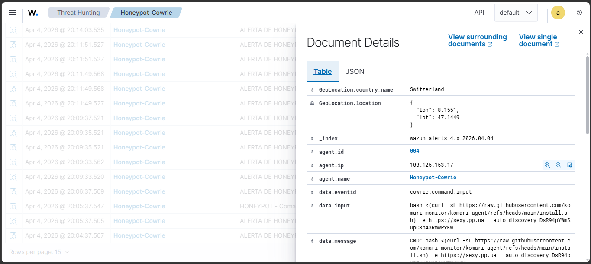
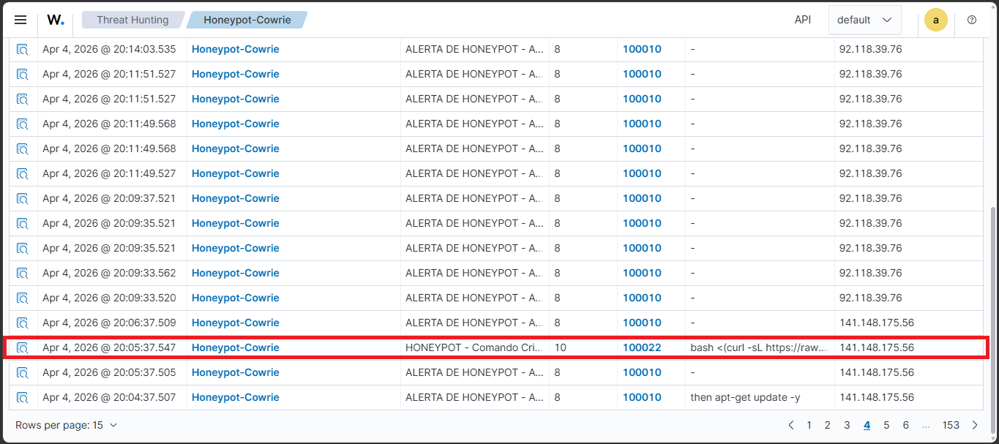

# 🛡️ SOC & Threat Intelligence Lab: Caçando Ameaças em Tempo Real

Bem-vindo ao meu laboratório de Cibersegurança! 

Este projeto foi construído do zero com o objetivo de ir além da teoria. Em vez de apenas simular ataques em um ambiente fechado, eu construí um **Centro de Operações de Segurança (SOC) na nuvem** e posicionei "iscas" na internet pública para atrair, capturar e analisar ataques cibernéticos reais operados por hackers e botnets globais.

### 🎯 O Objetivo do Projeto
Demonstrar a arquitetura, o monitoramento e a resposta a incidentes de uma rede corporativa, aplicando conceitos práticos de **Blue Team**, **Threat Intelligence** e **Hardening de Infraestrutura**.

---

## 🏗️ Como a Arquitetura Funciona (Visão Geral)

Para garantir que o laboratório fosse seguro enquanto "brincava" com fogo na internet, dividi a arquitetura em duas frentes:

1. **A Vitrine (A Isca):** Um servidor intencionalmente vulnerável (Honeypot) exposto à internet para atrair atacantes. Além disso, uma aplicação web de e-commerce simulando falhas reais para estudos de WebSec.
2. **O Cofre (O Monitoramento):** O cérebro da operação (o SIEM) fica isolado e invisível para a internet. Toda a gestão do laboratório e a comunicação de dados ocorre exclusivamente através de uma rede privada criptografada (VPN Zero-Trust), garantindo que os invasores não consigam acessar a minha infraestrutura real.

---

## 🔬 O Impacto: Estudo de Caso de um Ataque Real

A eficácia do laboratório foi provada quando **capturamos um ataque em tempo real** de um IP automatizado tentando invadir a nossa isca. 

**O que o atacante tentou fazer:**
O invasor acessou o servidor falso e tentou executar um ataque conhecido como *Fileless Malware* (Malware sem arquivo). Ele utilizou comandos para baixar um script de Comando e Controle (C2) disfarçado e executá-lo diretamente na memória, seguido por uma tentativa de apagar os próprios rastros para enganar os analistas de segurança.

**O resultado da nossa defesa:**
* **Contenção:** Por se tratar de um ambiente simulado dentro de um contêiner (Docker), o ataque foi totalmente contido e não afetou o servidor real.
* **Captura:** O laboratório interceptou o malware (identificado como *komari-agent*) e o colocou em quarentena.
* **Visibilidade:** O SIEM processou o ataque instantaneamente, gerando um alerta de Nível Crítico (Level 10) e extraindo para o Dashboard exatamente o comando malicioso e o país de origem do ataque.

> *🖼️ Imagem do mapa de geolocalização com o comando malicioso aqui: - *

> *🖼️ Imagem do alerta nível 10 aqui: - *

---

## 🛠️ Stack Tecnológico (Ferramentas Utilizadas)

* **SIEM & Detecção de Ameaças:** Wazuh, Elastic Stack (Filebeat, OpenSearch).
* **Sensores & Alvos:** Cowrie (Honeypot SSH/Telnet), OWASP Juice Shop.
* **Infraestrutura & Rede:** Oracle Cloud (OCI), Tailscale (VPN), Suricata (IDS), Docker, Linux Ubuntu Server.
* **Defesa & Hardening:** iptables (Firewall persistente), Expressões Regulares (PCRE2) para extração de logs, manipulação de pipeline JSON.

---

## ⚙️ Deploy dos Sensores (Docker)

Para manter o isolamento do servidor host, os sensores e alvos foram executados via contêineres utilizando mapeamento de portas e volumes locais para a ingestão do SIEM.

**Subindo a isca do Honeypot (Cowrie):**
```bash
docker run -d -p 22:2222 -p 23:2223 \
-v /var/log/cowrie/cowrie.json:/cowrie/cowrie-git/var/log/cowrie/cowrie.json \
--restart always --name cowrie cowrie/cowrie
```

---

## 📂 Para Engenheiros e Analistas Técnicos

Se você é da área técnica e deseja analisar *como* essa infraestrutura foi codificada, sinta-se à vontade para explorar os diretórios deste repositório:

* 📁 **`wazuh/`**: Contém as regras customizadas de detecção de TTPs (Táticas, Técnicas e Procedimentos) em XML e o tuning de processamento de logs via Filebeat.

---
